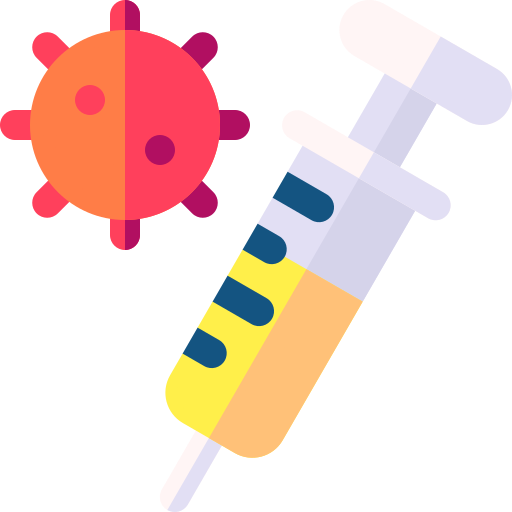
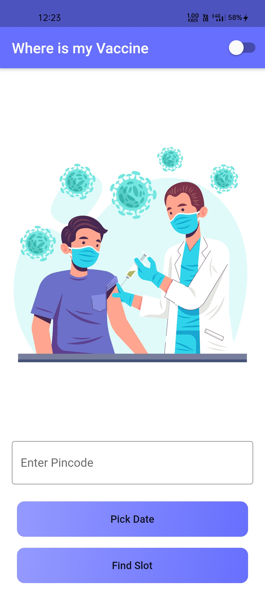
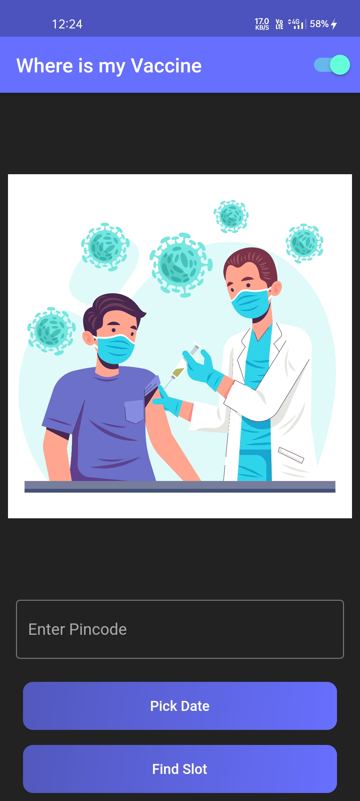
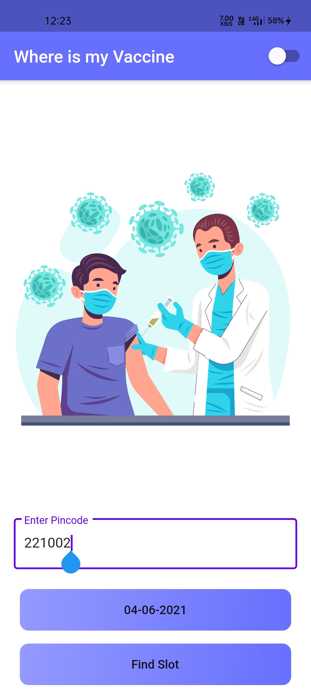
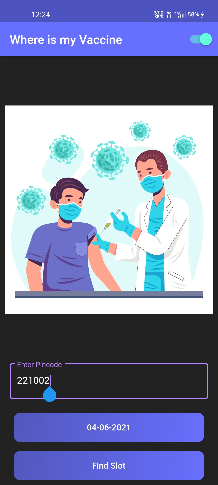
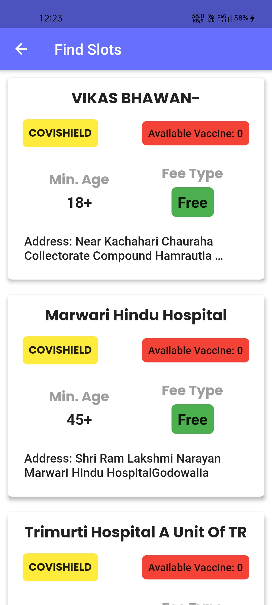

#  Vaccine Finder App.


[](https://twitter.com/ashwanisng)

A simple Flutter app to find the vaccine near by you.

<p align="center"></p>

<br/>

The [API Setu](https://apisetu.gov.in/) was used to fetch slots. <br>
<br>
<br> Please star⭐ the repo if you like what you see😉.

## 💻 Requirements

- Any Operating System (ie. MacOS X, Linux, Windows)
- Any IDE with Flutter SDK installed (ie. IntelliJ, Android Studio, VSCode etc)
- A little knowledge of Dart and Flutter

## ✨ Features

- [x] find vaccine centers near you by Pincode
- [x] Dark Mode
- [x] Simple UI.


# 🔌 Plugins

| Name                                                    | Usage                                               |
| ------------------------------------------------------- | --------------------------------------------------- |
| [**Provider**](https://pub.dev/packages/provider)       | State Management                                    |
| [**Http**](https://pub.dev/packages/http)               | A composable, Future-based library for making HTTP requests.|
| [**Intl**](https://pub.dev/packages/intl)               | Provides internationalization and localization facilities, including message translation, plurals and genders, date/number formatting and parsing, and bidirectional text.|
| [**Shared Preferences**](https://pub.dev/packages/shared_preferences)| Flutter plugin for reading and writing simple key-value pairs. Wraps NSUserDefaults on iOS and SharedPreferences on Android.|


## 📸 ScreenShots

<!--  -->

| Light                             | Dark                              |
| --------------------------------- | --------------------------------- |
|   |   |
|   |   |
|   |   |
|   |   |


## Contribution Guidelines🏗

Missing any of your favorite features, which you think you can add to it❓ Invite you to contribute to this project and make it better?
To start contributing, follow the below guidelines:

**1.** Fork [this](https://github.com/ashwanisng/Vaccine-Finder) repository.

**2.** Clone your forked copy of the project.

```
git clone --depth 1 https://github.com/<your_user_name>/Vaccine-Finder.git
```

**3.** Navigate to the project directory :file_folder: .

```
cd DocLense
```

**4.** Add a reference(remote) to the original repository.

```
git remote add upstream https://github.com/ashwanisng/Vaccine-Finder.git
```

**5.** Check the remotes for this repository.

```
git remote -v
```

**6.** Always take a pull from the upstream repository to your master branch to keep it at par with the main project(updated repository).

```
git pull upstream master
```

Note: in this project, the master branch is called the main branch, so try

```
git pull upstream main
```

**7.** Create a new branch.

```
git checkout -b <your_branch_name>
```

**8.** Perform your desired changes to the code base.

<p align="center"></p>

**9.** Track your changes:heavy_check_mark: .

```
git add .
```

**10.** Commit your changes.

```
git commit -m "Relevant message"
```

**11.** Push the committed changes in your feature branch to your remote repo.

```
git push -u origin <your_branch_name>
```

**12.** To create a pull request, click on `compare and pull requests. Please ensure you compare your feature branch to the desired branch of the repo you are supposed to make a PR to.


**13.** Add appropriate title and description to your pull request explaining your changes and efforts done.

**14.** Click on `Create Pull Request`.


**15.**  You have made a PR.

<p align="center"></p>


## 🔖 LICENCE

[MIT License](https://github.com/ashwanisng/Vaccine-Finder/blob/master/LICENSE)

<p align="center"></p>

